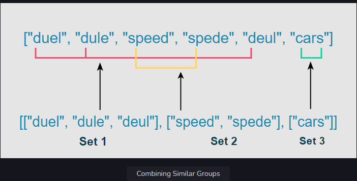
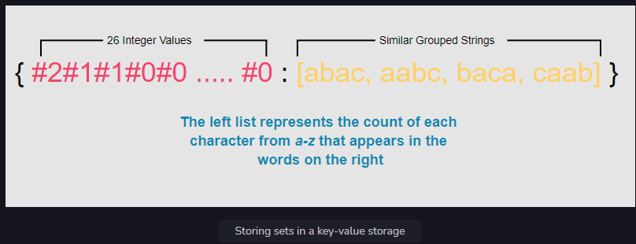

# Feature 1: Group Similar Titles

### Implementing the "Group Similar Titles" feature for our "Netflix" project.

### Description

First, we need to figure out a way to individually group all the character combinations of each title. Suppose the
content library contains the following titles: "duel", "dule", "speed", "spede", "deul", "cars". How would you
efficiently implement a functionality so that if a user misspells speed as spede, they are shown the correct title?

We want to split the list of titles into sets of words so that all words in a set are anagrams. In the above list, there
are three sets: {"duel", "dule", "deul"}, {"speed", "spede"}, and {"cars"}. Search results should comprise all members
of the set that the search string is found in. We should pre-compute these sets instead of forming them when the user
searches a title.

Here is an illustration of this process:

### Solution

From the above description, we see that all members of each set are characterized by the same frequency of each
alphabet. This means that the frequency of each alphabet in words belonging to the same group is equal. In the set {{"
speed", "spede"}}, the frequency of the characters s, p, e, and d are the same in each word.

Let’s see how we might implement this functionality:

For each title, compute a 26-element vector. Each element in this vector represents the frequency of an English letter
in the corresponding title. This frequency count will be represented as a string delimited with # characters. For
example, abbccc will be represented as #1#2#3#0#0#0...#0. This mapping will generate identical vectors for strings that
are anagrams.

Use this vector as a key to insert the titles into a Hash Map. All anagrams will be mapped to the same entry in this
Hash Map. When a user searches a word, compute the 26-element English letter frequency vector based on the word. Search
in the Hash Map using this vector and return all the map entries.

Store the vector of the calculated character counts in the same Hash Map as a key and assign the respective set of
anagrams as its value.

Return the values of the Hash Map, since each value will be an individual set.

Let’s look at the following illustration to clarify this process:

### Complexity measures

Let n be the size of the list of strings, and k be the maximum length that a single string can have.

### Time Complexity

We are counting each letter for each string in a list, so the time complexity will be O(n×k).

### Space complexity

Since every string is being stored as a value in the dictionary whose size can be n, and the size of the string can be
k, so space complexity is O(n×k).

