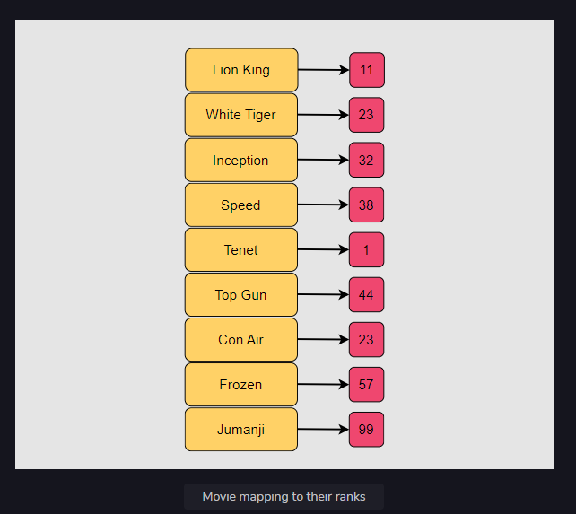
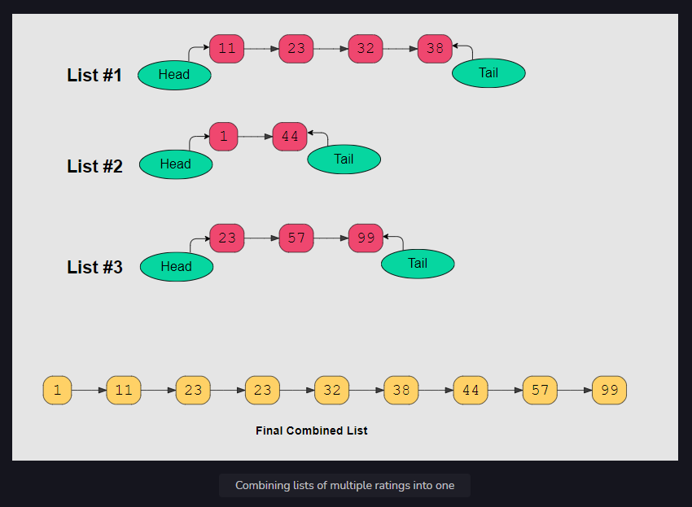

# Feature 2: Fetch Top Movies

### Implementing the "Fetch Top Movies" feature for our "Netflix" project.

### Description

Now, we need to build a criterion so the top movies from multiple countries will combine into a single list of top-rated
movies. In order to scale, the content search is performed in a distributed fashion. Search results for each country are
produced in separate lists. Each member of a given list is ranked by popularity, with 1 being most popular and
popularity decreasing as the rank number increases.

Let’s say that the following titles are represented by the provided IDs:

Movie mapping to their ranks
We’ll be given n arrays that are all sorted in ascending order of popularity rank. We have to combine these lists into a
single list that will be sorted by rank in ascending order, meaning from best to worst.

Keep in mind that the ranks are unique to individual movies and a single rank can be in multiple lists.

Let’s understand this better with an illustration:

### Solution

Since our task involves multiple lists, you should divide the problem into multiple tasks, starting with the problem of
combining two lists at a time. Then, you should combine the result of those first two lists with the third list, and so
on, until the very last one is reached.

Let’s discuss how we will implement this process:

Consider the first list as the result, and store it in a variable.

Traverse the list of lists, starting from the second list, and combine it with the list we stored as a result. The
result should get stored in the same variable.

When combining the two lists, like l1 and l2, maintain a prev pointer that points to a dummy node.

If the value for list l1 is less than or equal to the value for list l2, connect the previous node to l1 and increment
l1. Otherwise, do the same but for list l2.

Keep repeating the above step until one list points to a null value.

Connect the non-null list to the merged one and return.

Let’s look at the code for the solution below:

### Complexity measures

### Time Complexity

The time complexity will be O(n * k ^ 2) , where k is the number of the lists and n is the maximum length of a single
list.

### Space complexity

O(1), as constant space was utilized.

